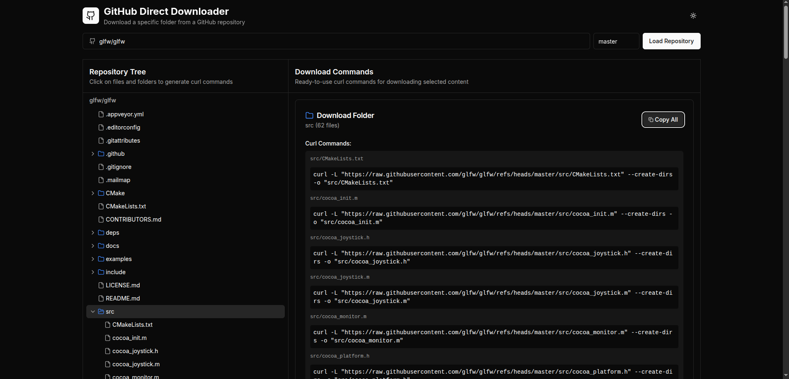

# Github Direct Downloader

Want to download a specific folder or a single file from a Github repo without cloning the whole repo?

Visit the website: [github-direct-downloader.vercel.app](https://github-direct-downloader.vercel.app)



Make sure to give the repo a star :)

## Research

In case you want to build something similar for whatever reason, here are my foundings:

### Get a list of files

To get a list of files from a repo use this api:

```bash
https://api.github.com/repos/{USER}/{REPO}/git/trees/{BRANCH}\?recursive\=1
```

Example:

```bash
https://api.github.com/repos/Gholamrezadar/GHDcode/git/trees/main\?recursive\=1
```


### Get direct link to a file

```bash
https://raw.githubusercontent.com/{USER}/{REPO}/refs/heads/{BRANCH}/{path/to/file.ext}
```

### Download using curl

To download a file using curl and place it in it's original structure use this command (`--create-dirs` is important)

```bash
curl -L "https://raw.githubusercontent.com/{USER}/{REPO}/refs/heads/{BRANCH}/{path/to/file.ext}" --create-dirs -o "path/to/file.ext"
```

Example:
```bash
curl -L "https://raw.githubusercontent.com/gholamrezadar/ghdcode/refs/heads/main/resources/sample%20copy.txt" --create-dirs -o "resources/sample copy.txt"
```


## Credits

GPT 5, Bolt & Gholamreza Dar 2025

(Frontend mostly done by Bolt with minor tweaks from me)

